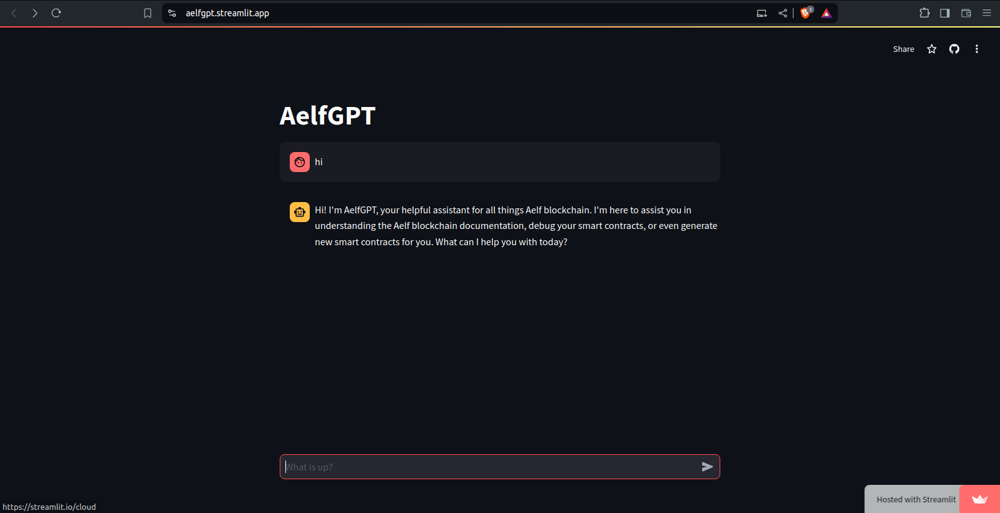

# Aelfgpt

[Live app](https://aelfgpt.streamlit.app/)

AelfGPT is a GPT chat model perfectly geered towards the Aelf blockchain developers with the aim to soften development burden on the developers.

Just like ChatGPT, but for Aelf.

AelfGPT is a RAG-enabled model, a smart contract debugger and a smart contract generator for the Aelf blockchain. At its core, AelfGPT is powered by Google's Gemini.

## Demo



## Technologies

This application was brought to life using the following technologies

1. Gemini
2. Atlas MongoDB
3. Llama Index
4. Streamlit

## Setup

*Option 1*

Use Gitpod: go to [https://gitpod.io/#https://github.com/balojey/aelfgpt](https://gitpod/#https://github.com/balojey/aelfgpt)

All dependencies will be installed automatically

*Option 2*

Clone this repo: `git clone https://github.com/balojey/aelfgpt`

Then, install dependencies: `poetry install`

## Run AelfGPT

Populate your environment variables in `.streamlit/secrets.toml`

```
    ATLAS_URI = "mongodb+srv://<username>:<password>@cluster0.nzbehil.mongodb.net/?retryWrites=true&w=majority&appName=Cluster0"
    GEMINI_API_KEY = ""
```

Then, run: `poetry run streamlit run src/AelfGPT.py`